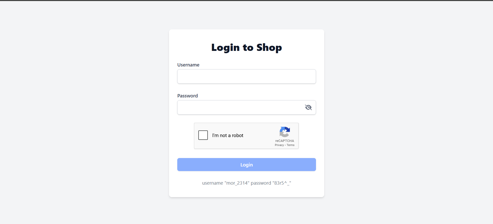
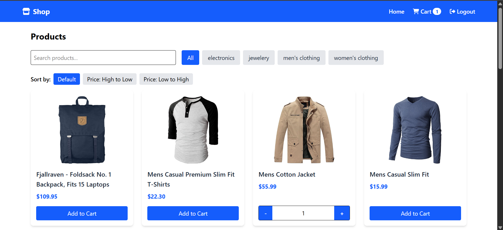
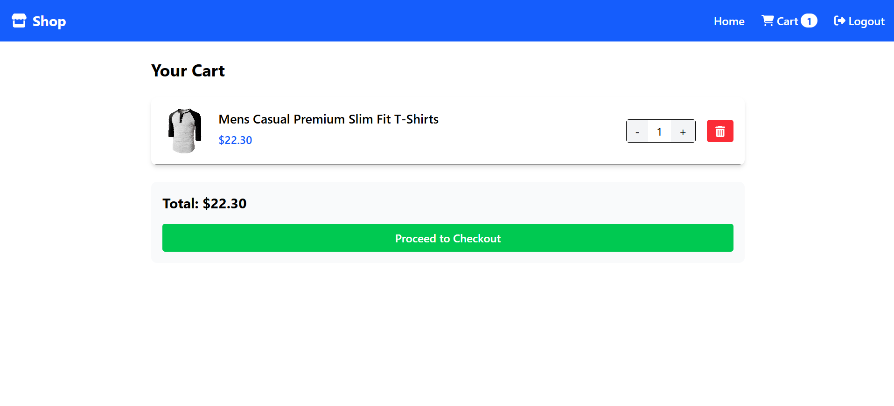
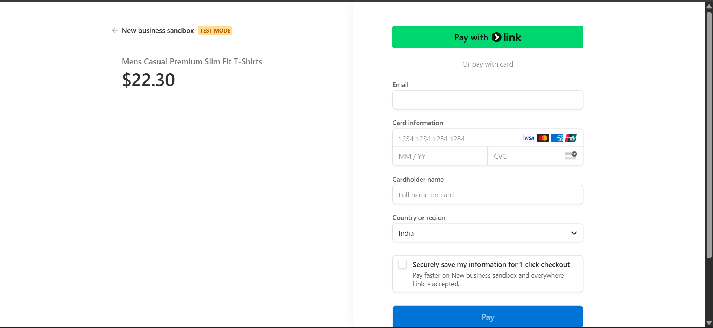
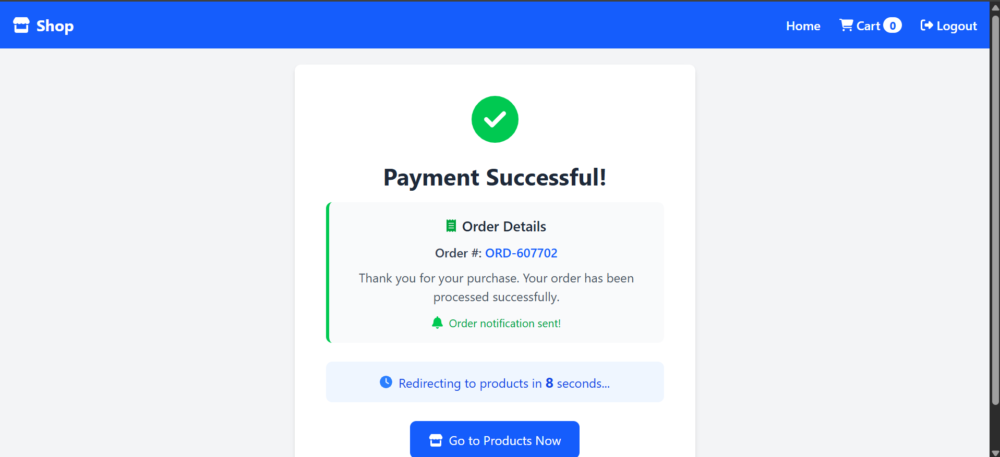

# Shopsy - React E-commerce Website

## 🚀 Live Demo

[](https://shopify-tau-seven.vercel.app)

## Overview

Shop is a modern, responsive e-commerce website built with React. The application provides a seamless shopping experience with features like user authentication, product browsing, cart management, secure checkout functionality, and push notifications.

## 🚀 Features

- **User Authentication** - Secure login system with token-based authentication and reCAPTCHA verification
- **Product Catalog** - Browse products with category filtering and search functionality
- **Product Details** - View detailed information about each product
- **Shopping Cart** - Add, remove, and update quantities of products
- **Payment Processing** - Secure checkout with Stripe payment integration
- **Push Notifications** - Order confirmations using Firebase Cloud Messaging
- **Responsive Design** - Optimized for both desktop and mobile devices
- **Category Filtering** - Filter products by categories
- **Search Functionality** - Search products by name
- **Sort Products** - Sort products by price (high to low or low to high)
- **Interactive UI** - User-friendly interface with intuitive navigation

## 🛠️ Technologies Used

- **Frontend:**
  - **React** - Frontend library for building the user interface
  - **React Router** - For navigation and routing
  - **Tailwind CSS** - For styling and responsive design
  - **FontAwesome** - For icons and visual elements
  - **React Google reCAPTCHA** - For user verification during login
  - **Firebase** - For push notifications via Firebase Cloud Messaging

- **Backend:**
  - **Express** - Node.js web application framework for the backend
  - **Stripe** - For secure payment processing
  - **Cors** - For handling cross-origin requests
  - **Firebase Admin** - For sending server-side notifications

- **APIs:**
  - **Fake Store API** - For product data and authentication
  - **Google reCAPTCHA API** - For security verification
  - **Stripe API** - For payment processing
  - **Firebase Cloud Messaging API** - For push notifications

- **Storage:**
  - **LocalStorage** - For persisting cart and authentication state

## 📋 Prerequisites

- Node.js (v14.0.0 or later)
- npm (v6.0.0 or later)
- Stripe account for payment processing
- Google reCAPTCHA keys
- Firebase project with Cloud Messaging enabled

## 🔧 Installation

1. Clone the repository
   ```bash
   git clone https://github.com/Saksham-Goel1107/Shop.git
   cd shop
   ```

2. Install Shop dependencies
   ```bash
   npm install
   ```

3. Set up Shop environment variables
   Create a .env file in the shop directory with:
   ```
   VITE_API_BASE_URL=http://localhost:5000/api
   VITE_REACT_APP_SITE_KEY=your_recaptcha_site_key
   VITE_FIREBASE_API_KEY=your_firebase_api_key
   VITE_FIREBASE_AUTH_DOMAIN=your_firebase_auth_domain
   VITE_FIREBASE_PROJECT_ID=your_firebase_project_id
   VITE_FIREBASE_STORAGE_BUCKET=your_firebase_storage_bucket
   VITE_FIREBASE_MESSAGING_SENDER_ID=your_firebase_messaging_sender_id
   VITE_FIREBASE_APP_ID=your_firebase_app_id
   VITE_FIREBASE_MEASUREMENT_ID=your_firebase_measurement_id
   VITE_FIREBASE_VAPID_KEY=your_firebase_vapid_key
   ```

4. Install backend dependencies
   ```bash
   cd ../Backend
   npm install
   ```

5. Set up backend environment variables
   Create a .env file in the Backend directory with:
   ```
   STRIPE_SECRET_KEY=your_stripe_secret_key
   SITE_SECRET_KEY=your_recaptcha_secret_key
   PORT=5000
   FIREBASE_PROJECT_ID=your_firebase_project_id
   FIREBASE_CLIENT_EMAIL=your_firebase_client_email
   FIREBASE_PRIVATE_KEY=your_firebase_private_key
   ```

6. Start the backend server
   ```bash
   node index
   ```

7. In a new terminal, start the frontend development server
   ```bash
   cd ../shop
   npm run dev
   ```

8. Open your browser and navigate to `http://localhost:5173`

## 🔑 Usage

### Login
Use the following credentials to log in:
- Username: `mor_2314`
- Password: `83r5^_`

### Product Browsing
- Browse all products on the home page
- Filter products by categories
- Search for products using the search bar
- Sort products by price (high to low or low to high)
- Click on a product to view details

### Shopping Cart
- Add products to your cart
- Update quantities directly from product pages or cart
- Remove items from cart
- Proceed to checkout with Stripe payment

### Notifications
- Enable browser notifications to receive order confirmations
- Notifications are sent automatically after successful checkout

## 📁 Project Structure

```
project/
├── shop/                   # Frontend
│   ├── public/
│   │   ├── firebase-messaging-sw.js
│   │   ├── icon.png
│   │   └── vite.svg
│   ├── src/
│   │   ├── components/
│   │   │   └── header.jsx
│   │   ├── pages/
│   │   │   ├── cart.jsx
│   │   │   ├── login.jsx
│   │   │   ├── productDetails.jsx
│   │   │   ├── productListing.jsx
│   │   │   └── success.jsx
│   │   ├── App.jsx
│   │   ├── App.css
│   │   ├── firebase.js
│   │   ├── index.css
│   │   └── main.jsx
│   ├── index.html
│   ├── package.json
│   ├── vite.config.js
│   └── vercel.json
├── Backend/                # Backend
│   ├── api/
│   │   ├── notification.js
│   │   ├── stripe.js
│   │   └── verify-recaptcha.js
│   ├── index.js
│   └── package.json
├── LICENSE
└── README.md
```

## 🌐 API Reference

### Fake Store API
This project uses the [Fake Store API](https://fakestoreapi.com/docs) for product data and authentication.

- `GET /products` - Get all products
- `GET /products/categories` - Get all categories
- `GET /products/category/{categoryName}` - Get products by category
- `GET /products/{id}` - Get a single product
- `POST /auth/login` - User authentication

### Backend API
Custom backend API endpoints:

- `POST /api/verify-recaptcha` - Verify Google reCAPTCHA tokens
- `POST /api/stripe/payment` - Create Stripe payment sessions
- `POST /api/send-notification` - Send Firebase Cloud Messaging notifications

## 📸 Screenshots







## 🚀 Future Enhancements

- User registration functionality
- Product reviews and ratings
- Order history tracking
- Wishlist feature
- Admin dashboard for product management
- Enhanced notification preferences

## 👥 Contributors

- Saksham Goel - [GitHub](https://github.com/Saksham-Goel1107/)

## 📝 License

This project is licensed under the MIT License - see the LICENSE file for details.

## 🙏 Acknowledgments

- [Fake Store API](https://fakestoreapi.com/) for providing the product data
- [Tailwind CSS](https://tailwindcss.com/) for the styling framework
- [FontAwesome](https://fontawesome.com/) for the icons
- [React](https://reactjs.org/) and [React Router](https://reactrouter.com/) for the frontend framework
- [Stripe](https://stripe.com/) for the payment processing solution
- [Google reCAPTCHA](https://www.google.com/recaptcha/) for security verification
- [Firebase](https://firebase.google.com/) for push notification functionality

---

*Made with ❤️ by [Saksham Goel](https://github.com/Saksham-Goel1107)*